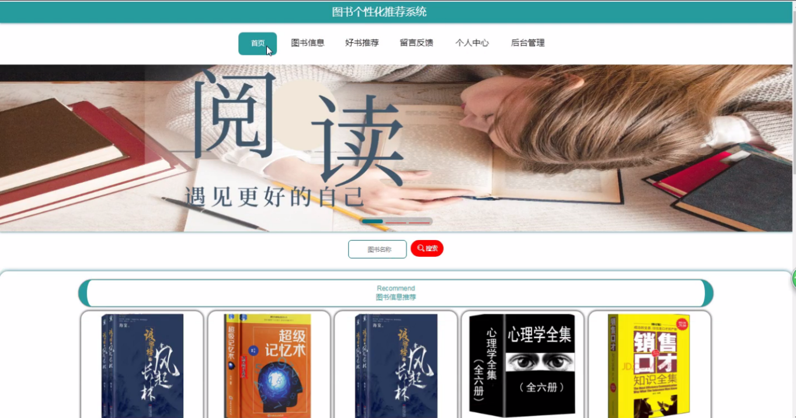

## 图书个性化推荐系统(程序+报告)

- <b>完整代码获取地址：从戎源码网 ([https://armycodes.com/](https://armycodes.com/))</b>
- <b>技术探讨、资料分享，请加QQ群：692619798</b> 
- <b>作者微信：19941326836  QQ：952045282</b> 
- <b>承接计算机毕业设计、Java毕业设计、Python毕业设计、深度学习、机器学习</b>
- <b>选题+开题报告+任务书+程序定制+安装调试+论文+答辩ppt 一条龙服务</b>
- <b>所有选题地址 ([https://github.com/YuLin-Coder/AllProjectCatalog](https://github.com/YuLin-Coder/AllProjectCatalog)) </b>

## 项目介绍
图书个性化推荐系统，系统包含两种角色：用户、管理员，系统分为前台和后台两大模块，主要功能如下：

1 前台首页功能模块
前台首页功能模块主要包括以下内容：
首页：展示系统的主要功能和信息。
图书信息：提供图书的详细信息，包括预约和收藏操作。
好书推荐：推荐学生可能感兴趣的好书。
留言反馈：允许用户留言并管理留言板。
个人中心：学生可以在这里更新个人信息和退出登录。
后台管理：管理员可以进入后台管理系统。

2 管理员功能模块
管理员功能模块包括以下内容：
管理员登录：通过用户名和密码登录系统。
学生管理：管理学生信息，包括修改和删除操作。
图书分类管理：管理图书的分类信息。
图书信息管理：管理图书的详细信息，包括修改、删除、预约等操作。
图书预约管理：管理图书的预约情况，包括审核和处理预约请求。
退换图书管理：管理学生的图书退换请求。
管理员管理：管理系统管理员的信息。
留言板管理：管理用户的留言和回复。
系统管理：管理系统的整体运行和设置。

3 学生功能模块
学生功能模块包括以下内容：
个人中心：学生可以查看和修改个人信息。
图书预约管理：学生可以预约图书，并查看预约状态。
退换图书管理：学生可以申请退换图书。
我的收藏管理：学生可以管理自己收藏的图书信息。

## 项目技术
- 编程语言：Java
- 数据库：MySQL
- 项目管理工具：Maven
- 前端技术：HTML、CSS、JavaScript、Vue
- 后端技术：Spring、SpringMVC、MyBatis

## 运行环境
- JDK版本：JDK1.8及以上
- 开发工具：IDEA、Ecplise、Myecplise都可以
- 数据库: MySQL5.7及以上
- Maven：maven3.0及以上
- Node：14.14.0及以上

## 运行截图

